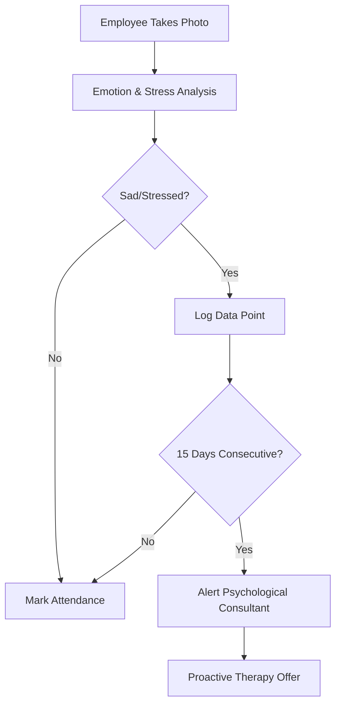

To make your README professional and visually engaging for your internship at Pakka Limited, you can use Markdown formatting like headers, badges, tables, and emojis.

Copy and paste the following code into a file named `README.md`:

-----

# 🧠 Sentimental Attendance & Well-being System

### *An AI-Driven Emotional Health Initiative for Pakka Limited*

-----

## 🎯 Project Aim

Standard attendance systems only track *when* an employee arrives. This project aims to track *how* an employee arrives. By integrating deep learning emotion recognition into the photo-based attendance system, we aim to:

1.  **Identify Silent Struggles:** Automatically detect persistent negative emotional states.
2.  **Data-Driven Compassion:** Monitor trends over a **15-day consecutive window**.
3.  **Proactive Intervention:** Trigger alerts for psychological consultation or therapy when an employee shows consistent signs of sadness, stress, or depression.

-----

## 🚀 Key Features

  * **Facial Emotion Recognition (FER):** Real-time classification of 7 basic emotions.
  * **Micro-Expression Tracking:** Analyzing 52 facial blendshapes (e.g., brow raising, lip tightening) for deeper stress analysis.
  * **Physiological Stress Detection:** Remote heart-rate monitoring (rPPG) via camera to detect anxiety.
  * **The 15-Day Trigger:** A logic-gated system that flags cases where "Sad/Depressed" scores remain high for 15 straight workdays.
  * **Cyberpunk UI:** A futuristic dashboard designed for consultants to visualize emotional trajectories.

-----

## 🛠 Tech Stack

| Component | Technology Used |
| :--- | :--- |
| **Back-end Logic** | Python 3.9 |
| **Deep Learning** | ResNet-50 / Keras |
| **Computer Vision** | OpenCV & MediaPipe |
| **Front-end UI** | Streamlit |
| **Data Viz** | Matplotlib & Mplcyberpunk |
| **Datasets** | FER2013 & CK+ |

-----

## 📐 System Architecture

### 1\. Image Processing

The system captures the attendance photo, converts it to **Grayscale**, and performs **Normalization** (scaling pixels to 0-1) to ensure the model focuses on structural features rather than lighting.

### 2\. The Recognition Pipeline

  * **Face Detection:** Uses MediaPipe to isolate the Face ROI (Region of Interest).
  * **Feature Extraction:** A CNN (Convolutional Neural Network) identifies key emotional markers.
  * **Trend Analysis:** Daily outputs are stored in a secure database to monitor the 15-day emotional moving average.

-----

## 📋 Logic Flow for Intervention



-----

## 🛠 Installation & Usage

1.  **Clone the repository:**
    ```bash
    git clone https://github.com/your-repo/pakka-emotion-system.git
    ```
2.  **Install dependencies:**
    ```bash
    pip install tensorflow opencv-python mediapipe streamlit pandas
    ```
3.  **Run the application:**
    ```bash
    streamlit run app.py
    ```

-----

## 🛡 Ethical Considerations

  * **Privacy First:** Raw images are processed in real-time and not stored; only the numerical "Emotion Score" is logged for trend analysis.
  * **Supportive, Not Punitive:** This data is strictly for mental health support and is never used for performance evaluation.

-----

**Developed during internship at Pakka Limited.**
*Focusing on the intersection of AI and Employee Well-being.*
